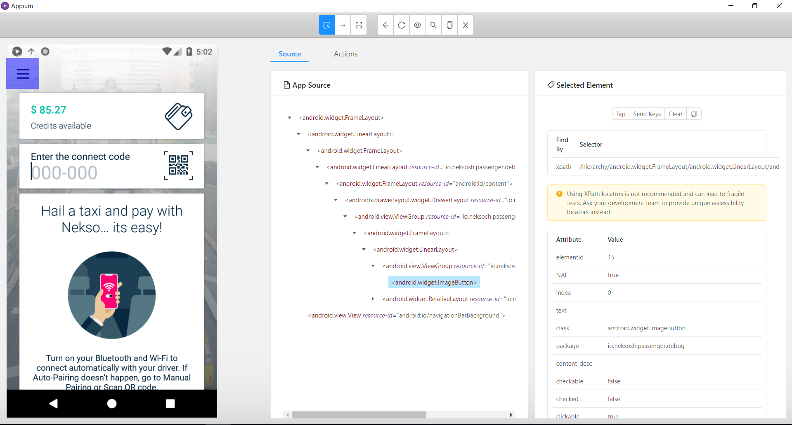

Installation for Windows: 
1. Download Python [https://www.python.org/downloads/]
 - set environment PATH for python, can be done during installation
2. Download Appium [http://appium.io/]
3. Install Android Studio/IntelliJ and Android SDK [https://developer.android.com/studio#downloads]
 - set ANDROID_HOME for SDK folder in Environment Variables
 - Using AVD Manager, create an emulator, a Google Pixel.
 - Right click on the device in the AVD manager, and cold boot 
4. Install Java JDK [https://www.oracle.com/technetwork/java/javase/downloads/jdk11-downloads-5066655.html]
5. Open Appium.exe
 - set host to 127.0.0.1
 - set port to 4723
 - Edit configurations and set ANDROID_HOME and JAVA_HOME apporiately 
 - start server
 6. Clone this repo to local machine
 7. Open command line
 - install pip by running python get-pip.py
 - install Appium Python client by running pip install Appium-Python-Client
 - navigate to local repo
 - run adb install nekso.apk
 > Test Cases
 - run python TC01.py
 - run python TC02.py
 - run python TC77.py `phone-number`, where `phone-number` is a registered phone number
 - run python login.py `phone-number` `password`, with valid credententials 
 
 Note:
 - Was unable to query select menu icon element once logged in with webdriver (despite using XPath, class name, etc), thus unable to create test cases involving menu icon options i.e. Profile, Payment, Help, and History. 
 
 
